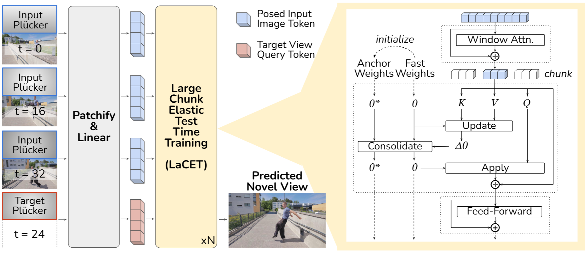

<h1 align="center">FSM: Fast Spatial Memory</h1>

This repository is a PyTorch/GPU implementation of [**Fast Spatial Memory with Elastic Test-Time Training**](https://fast-spatial-memory.github.io/), as well as a *self-reimplemented (non-official!)* version of [**4D-LRM**](https://4dlrm.github.io/).

Please note, **this repository is not distributed under a single uniform license**. The license terms applicable to a given file or implementation path depend on that file’s provenance. Users must comply with the license terms applicable to each file, directory, or implementation path, as described in `LICENSE.md` and in the corresponding license files and file headers.



## Environment Setup
We recommend using a virtual environment to manage your dependencies. You can create one using the following command to create a virtual environment under
```bash
virtualenv --no-download "venv/fsm" --prompt "fsm"  # Or "python3.10 -m venv venv/fsm"
source venv/fsm/bin/activate
```

Then, install the required dependencies:
```bash
pip install --upgrade pip
pip install -r envs/requirements.txt
```

Alternatively, use conda to create an environment:
```bash
conda env create -f envs/environment.yml
```

## Pretrained Checkpoints

### (For Inference) Pretrained 4D-LVSM & 4D-LRM with LaCET

Pretrained weights are available on [Hugging Face](https://huggingface.co/marstin/fast-spatial-mem).

- [x] Release the `res256` 4D-LVSM models
- [x] Release the `res256` 4D-LRM models
- [x] Release the `res128` base models
- [x] Add detailed model cards

```python
import os
import shutil
from huggingface_hub import hf_hub_download

repo_id = "marstin/fast-spatial-mem"
local_path = "static/weights"
path_in_repo = "lvsm_checkpoints/fsm_4dlvsm_patch8_res256.pth"

# Download (cached under ~/.cache/huggingface/hub)
cached_path = hf_hub_download(
    repo_id=repo_id,
    filename=path_in_repo,
    repo_type="model"
)

# Copy to your desired local folder
os.makedirs(os.path.dirname(local_path), exist_ok=True)
target_path = os.path.join(local_path, os.path.basename(path_in_repo))
shutil.copy(cached_path, target_path)
```

### (For Training) VGG19 for Perceptual Loss

Run this and should output "OK."
This will be used by `fsm/model/losses/perceptual_loss.py`

```bash
mkdir -p static/weights
wget -O static/weights/imagenet-vgg-verydeep-19.mat https://www.vlfeat.org/matconvnet/models/imagenet-vgg-verydeep-19.mat
cd weights
actual="$(md5sum imagenet-vgg-verydeep-19.mat)"; [[ "$actual" == "106118b7cf60435e6d8e04f6a6dc3657  imagenet-vgg-verydeep-19.mat" ]] && echo "OK" || { echo "Mismatch: $actual"; exit 1; }
```

## Quick Start

We provide `quickstart_training.ipynb` and `quickstart_inference.ipynb` for quick start.

## Data Preparation

See `static/datasets/example` for the data structure.

- [ ] Provide data processing scripts
- [ ] Add detailed data cards

## Pretraining

To pretrain FSM-LVSM from scratch, run

```bash
bash scripts/launch_fsm_lvsm_pretrain.sh
```

To pretrain FSM-LRM from scratch, run

```bash
bash scripts/launch_fsm_lrm_pretrain.sh
```

## Finetuning

To upscale the resolution of FSM-LVSM from an existing checkpoint, run

```bash
bash scripts/launch_fsm_lvsm_finetune.sh
```

To upscale the resolution of FSM-LRM from an existing checkpoint, run

```bash
bash scripts/launch_fsm_lrm_finetune.sh
```

## Evaluation

To evaluate the FSM-LVSM model on Steoro4D test set:

```bash
bash scripts/launch_fsm_lvsm_eval.sh
```

To evaluate the FSM-LRM model on Steoro4D test set:

```bash
bash scripts/launch_fsm_lrm_eval.sh
```

## Citations

### Fast Spatial Memory with Elastic Test-Time Training
Ziqiao Ma*, Xueyang Yu*, Haoyu Zhen, Yuncong Yang, Joyce Chai, Chuang Gan 

[](https://arxiv.org/abs/2604.07350)
[](https://fast-spatial-memory.github.io/)
[](https://huggingface.co/marstin/fast-spatial-mem)

```bibtex
@article{ma2026fast,
  title={Fast Spatial Memory with Elastic Test-Time Training},
  author={Ma, Ziqiao and Yu, Xueyang and Zhen, Haoyu and Yang, Yuncong and Chai, Joyce and Gan, Chuang},
  journal={arXiv preprint arXiv:2604.07350},
  year={2026}
}
```

### 4D-LRM: Large Space-Time Reconstruction Model From and To Any View at Any Time
Ziqiao Ma, Xuweiyi Chen, Shoubin Yu, Sai Bi, Kai Zhang, Chen Ziwen, Sihan Xu, Jianing Yang, Zexiang Xu, Kalyan Sunkavalli, Mohit Bansal, Joyce Chai, Hao Tan

[](https://arxiv.org/abs/2506.18890)
[](https://4dlrm.github.io/)
[](https://huggingface.co/marstin/fast-spatial-mem)

```bibtex
@inproceedings{ma20254dlrm,
  title={4D-LRM: Large Space-Time Reconstruction Model From and To Any View at Any Time},
  author={Ma, Ziqiao and Chen, Xuweiyi and Yu, Shoubin and Bi, Sai and Zhang, Kai and Ziwen, Chen and Xu, Sihan and Yang, Jianing and Xu, Zexiang and Sunkavalli, Kalyan and others},
  booktitle={The Thirty-ninth Annual Conference on Neural Information Processing Systems},
  year={2025}
}
```
